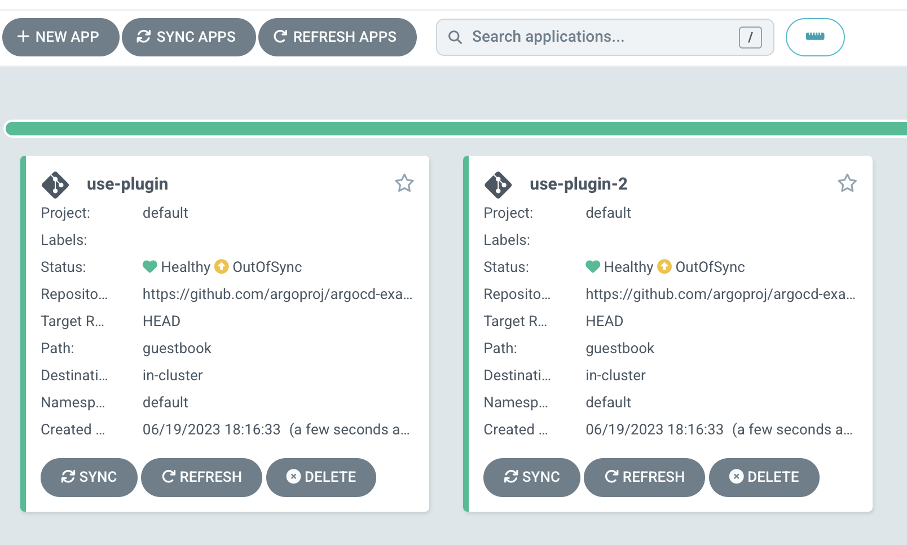

# Argo CD multiple plugins

Argo CD で複数種類の [Config Management Plugin](https://argo-cd.readthedocs.io/en/stable/operator-manual/config-management-plugins/#config-management-plugins) を動かしてみる

## 重要事項

[GitHub の discussion](https://github.com/argoproj/argo-cd/discussions/12278#discussioncomment-5338514) によると、複数の plugin を用意したい場合は、それぞれの plugin ごとに cmp sidecar を用意する必要があるらしい

## 前提: Argo CD をデプロイ

helm でインストールする

[values.yaml](./values.yaml) のように、 `.repoServer.extraContainers` に 2つ sidecar を用意し、 2種の plugin を作成

- `my-plugin`: "cm1" という名前の空の configMap を生成する
- `my-plugin2`: "cm2" という名前の空の configMap を生成する

```sh
kubectl create ns argocd
kubectl apply -n argocd -f plugin.yaml
helm install argo-cd argo/argo-cd --namespace argocd -f values.yaml --version 5.25.0
argocd admin initial-password -n argocd # password を確認
kubectl port-forward svc/argo-cd-argocd-server -n argocd 8080:443
```

 でパスワードを確認し、 https://localhost:8080 から Argo CD にログイン（安全ではない通信になるが無視）

username: admin
password: `argocd admin initial-password -n argocd` で出てくるもの

また、 cmp server が起動していることを確認

```
kubectl get pod -n argocd

NAME                                         READY   STATUS    RESTARTS   AGE
argo-cd-argocd-repo-server-7c4955769d-xmd7c  3/3     Running   0          41s
# container が 3台 になっている
```

## Argo CD Application をデプロイ

[argocd-apps.yaml](./argocd-apps.yaml) のように `my-plugin-v1.0` と `my-plugin-2-v1.0` を使う Application をそれぞれ用意

```
kubectl apply -n argocd -f argocd-apps.yaml
```

2つの application が作られる



それぞれ sync して、 default namespace の configMap を確認

```
k get cm
NAME               DATA   AGE
cm1                0      14s
cm2                0      14s
kube-root-ca.crt   1      10d
```

動いた
